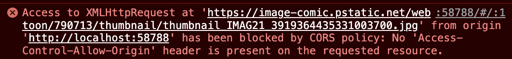

# toonflix

- Flutter webtoon 앱

## versions

- flutter: 3.10.1
- dart: 3.0.2

## settings

```bash
# 3.3.10 버전 사용
$ fvm use 3.10.1 --force

# create
$ fvm flutter create .

# pub get
$ fvm flutter pub get
```

## package

```bash
# http 패칭
$ fvm flutter pub add http
```

## code check

```bash
# 문법 및 에러 체크
$ dart analyze
$ dart fix --dry-run
# or
$ dart fix --apply
```

## issue

- Image.network 로 이미지 호출시 아래 cors 이슈 발생
  
  - flutter 구동방식을 vscode launch.json 설정을 통한 구동으로 변경
  - launch.json > web 에 web 구동시 `disable-web-security` 설정을 추가하여 해결
  - launch.json > web
    ```json
    ...
    {
      "name": "Web",
      "request": "launch",
      "type": "dart",
      "args": ["-d", "chrome", "--web-browser-flag", "--disable-web-security"]
    }
    ...
    ```
